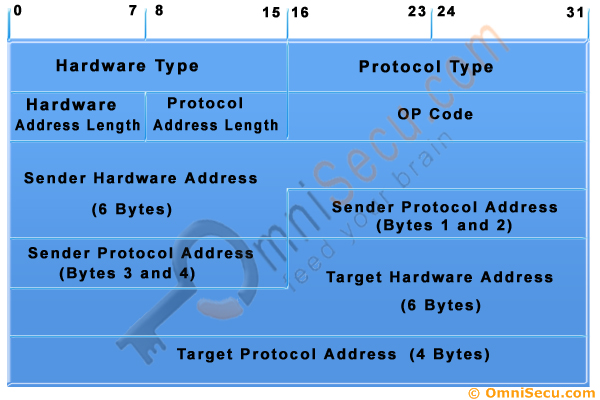

# Address Resolution Protocol (ARP) definition

Address Resolution Protocol (ARP) is a protocol for mapping an Internet Protocol address (IP address) to a physical machine address that is recognized in the local network. For example, in IP Version 4, the most common level of IP in use today, an address is 32 bits long. In an Ethernet local area network, however, addresses for attached devices are 48 bits long. (The physical machine address is also known as a Media Access Control or MAC address.) A table, usually called the ARP cache, is used to maintain a correlation between each MAC address and its corresponding IP address. ARP provides the protocol rules for making this correlation and providing address conversion in both directions.

### How ARP Works

When an incoming packet destined for a host machine on a particular local area network arrives at a gateway, the gateway asks the ARP program to find a physical host or MAC address that matches the IP address. The ARP program looks in the ARP cache and, if it finds the address, provides it so that the packet can be converted to the right packet length and format and sent to the machine. If no entry is found for the IP address, ARP broadcasts a request packet in a special format to all the machines on the LAN to see if one machine knows that it has that IP address associated with it. A machine that recognizes the IP address as its own returns a reply so indicating. ARP updates the ARP cache for future reference and then sends the packet to the MAC address that replied.

Since protocol details differ for each type of local area network, there are separate ARP Requests for Comments (RFC) for Ethernet, ATM, Fiber Distributed-Data Interface, HIPPI, and other protocols.

There is a Reverse ARP (RARP) for host machines that don't know their IP address. RARP enables them to request their IP address from the gateway's ARP cache.

### Address Resolution Protocol Tutorial, How ARP work, ARP Message Format

Address Resolution Protocol (ARP) is one of the major protocol in the TCP/IP suit and the purpose of Address Resolution Protocol (ARP) is to resolve an IPv4 address (32 bit Logical Address) to the physical address (48 bit MAC Address). Network Applications at the Application Layer use IPv4 Address to communicate with another device.  But at the Datalink layer, the addressing is MAC address (48 bit Physical Address), and this address is burned into the network card permanently. You can view your network card’s hardware address by typing the command "ipconfig /all" at the command prompt (Without double quotes using Windows Operating Systems).

The purpose of Address Resolution Protocol (ARP) is to find out the MAC address of a device in your Local Area Network (LAN), for the corresponding IPv4 address, which network application is trying to communicate.

Following are the fields in the Address Resolution Protocol (ARP) Message Format.

**Hardware Type:** Hardware Type field in the Address Resolution Protocol (ARP) Message specifies the type of hardware used for the local network transmitting the Address Resolution Protocol (ARP) message. Ethernet is the common Hardware Type and he value for Ethernet is 1. The size of this field is 2 bytes.

**Protocol Type:** Each protocol is assigned a number used in this field. IPv4 is 2048 (0x0800 in Hexa).

**Hardware Address Length:** Hardware Address Length in the Address Resolution Protocol (ARP) Message is length in bytes of a hardware (MAC) address. Ethernet MAC addresses are 6 bytes long.

**Protocol Address Length:** Length in bytes of a logical address (IPv4 Address). IPv4 addresses are 4 bytes long.

**Opcode:** Opcode field in the Address Resolution Protocol (ARP) Message specifies the nature of the ARP message. 1 for ARP request and 2 for ARP reply.

**Sender Hardware Address:** Layer 2 (MAC Address) address of the device sending the message.

**Sender Protocol Address:** The protocol address (IPv4 address) of the device sending the message

**Target Hardware Address:** Layer 2 (MAC Address) of the intended receiver. This field is ignored in requests.

**Target Protocol Address:** The protocol address (IPv4 Address) of the intended receiver.