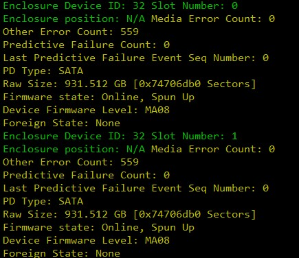
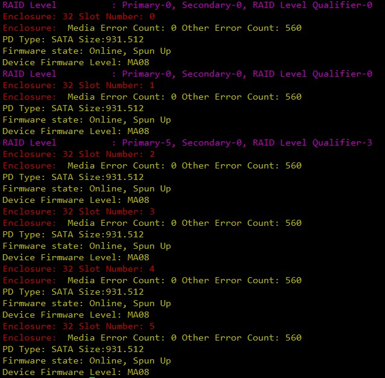

# Megacli package version

1. for viewing the status of each disk, and highlighted megacli script

```
/opt/MegaRAID/MegaCli/MegaCli64 -PDList -aAll -NoLog| grep -Ei '(enclosure|slot|error|firmware|pre|Foreign|^PD type|^Raw Size)' | awk '{if($0 ~ /Slot Number/ || $0 ~ /Enclosure/){printf("\033[32m%s ",$0);if($0 ~/Slot Number/) printf("\033[0m \n")}else if($0 ~ /bad/||$0 ~/Failed/||$0 ~ /Foreign State: Foreign/){print "\033[31m"$0"\033[0m"}else{print "\033[33m"$0"\033[0m"}}'
```

Output example: 2. Megacli script for viewing the various RAID Logical Disk



```
/opt/MegaRAID/MegaCli/MegaCli64 -LdPdInfo -aAll -NoLog|grep -Ei '(^Virtual Disk|^RAID Level|^PD type|^Raw Size|^Enclosure|^Slot|error|firmware)' | awk '{if($0~/^Virtual/||$0~/^RAID/){printf("\033[35m%s\033[0m\n",$0)}else if($0 ~ /^Enclosure/){printf("\033[31m%s: %s\033[0m ",$1,$4)}else if($0 ~ /^Slot/){printf("\033[31m%s\033[0m\n",$0)}else if($0~/^Other/||$0~/Firmware/){printf("\033[33m%s\033[0m\n",$0)}else if($0~/^Raw/){printf("\033[33m%s%s\033[0m\n",$2,$3)}else{printf("\033[33m%s\033[0m ",$0)}}'
```

For RAID Level of output, refer to the following table to the corresponding associated RAID level

|--|--|
|--|--|
|RAID Level : Primary-1, Secondary-0, RAID Level Qualifier-0|RAID 1
|RAID Level : Primary-0, Secondary-0, RAID Level Qualifier-0|RAID 0
|RAID Level : Primary-5, Secondary-0, RAID Level Qualifier-3|RAID 5
|RAID Level : Primary-1, Secondary-3, RAID Level Qualifier-0|RAID 10

Example result:


