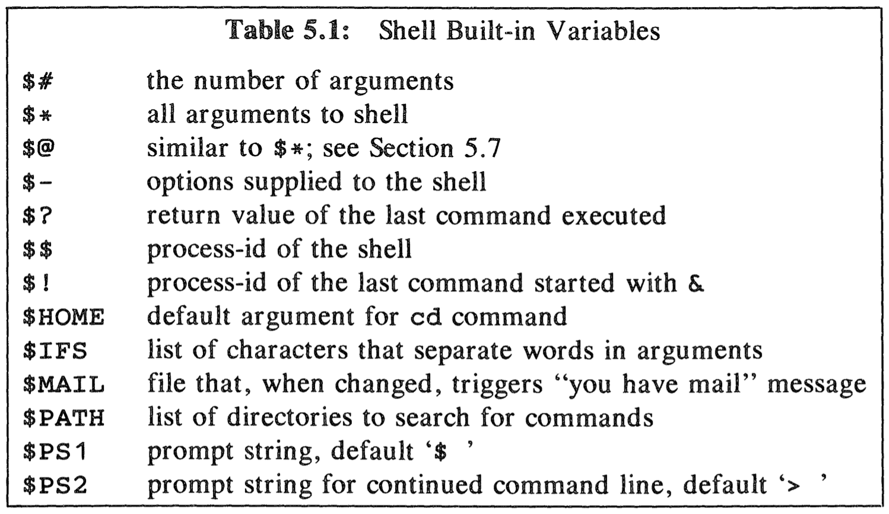

# Special Variables



There are a few other variables that the system sets for you to use as well.

* $0 - The name of the Bash script.
* $1 - $9 - The first 9 arguments to the Bash script. (As mentioned above.)
* $# - How many arguments were passed to the Bash script.
* $@ - All the arguments supplied to the Bash script.
* $? - The exit status of the most recently run process.
* $$ - The process ID of the current script.
* $USER - The username of the user running the script.
* $HOSTNAME - The hostname of the machine the script is running on.
* $SECONDS - The number of seconds since the script was started.
* $RANDOM - Returns a different random number each time is it referred to.
* $LINENO - Returns the current line number in the Bash script.

```
**$1, $2, ...**
```
The first, second, etc command line arguments to the script.

```
**variable=value**
```
To set a value for a variable. Remember, no spaces on either side of =
```
**Quotes " '**
```
Double will do variable substitution, single will not.
```
**variable=$( command )**
```
Save the output of a command into a variable
```
**export var1**
```
Make the variable var1 available to child processes.